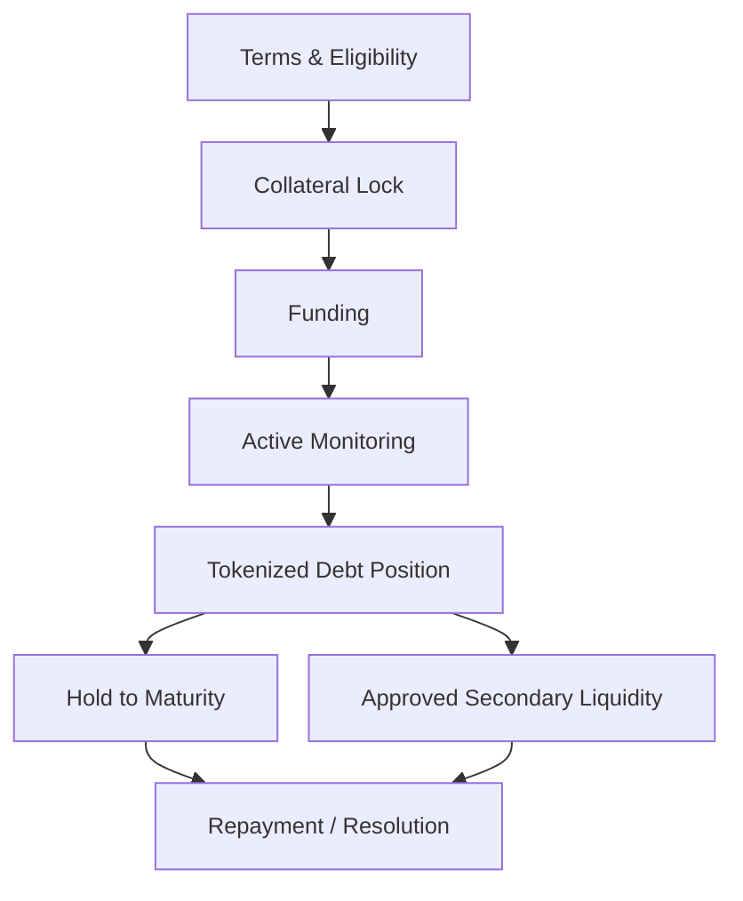

# Credit Lifecycle & Tokenized Debt

The credit layer is designed around a defined lifecycle so that key economic and enforcement terms are established before funding.





## 1. Origination

Borrower and lender or pool terms are established. Eligibility, collateral, maturity, pricing, LTV, fees, and resolution rules are validated before funding.

## 2. Collateral lock

Approved collateral is transferred to the relevant smart-contract or custody structure so that enforcement does not depend solely on offchain promises.

## 3. Funding

Capital is released only after required conditions are satisfied.

## 4. Monitoring

Oracle and market data can be used to monitor:

* collateral value,
* LTV,
* warning zones,
* liquidation zones,
* repayment status,
* maturity,
* liquidity conditions.

## 5. Tokenized debt

Approved credit positions can be represented as transferable debt instruments. Tokenization can support fractionalization, position transfer, accounting, and future market liquidity where legally and technically permitted.

## 6. Secondary-market liquidity

Lenders may hold positions to maturity or seek liquidity through approved market infrastructure. Secondary trading can create additional fee activity, but it also introduces liquidity, pricing, and market-structure risk.

## 7. Repayment or resolution

A position can close through repayment, liquidation, conversion where applicable, or another predefined resolution pathway. The applicable contract and legal terms control the outcome.
