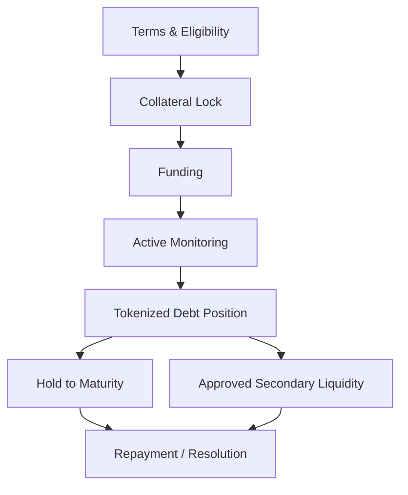

# Credit Protocol Architecture

The Onchain Matrix credit layer is designed to extend treasury infrastructure into collateralized credit and tokenized debt markets. It combines P2P matching, pool-based liquidity, and treasury participation within a common risk and settlement framework.


The credit layer is a roadmap component until the relevant production contracts are deployed and verified.


## Capital paths

The architecture supports three complementary sources of credit liquidity:

### P2P Matching

Lenders and borrowers can be matched around structured terms, allowing customized credit arrangements where appropriate.

### Pool-Based Liquidity

Shared liquidity pools can support more standardized borrowing access and improve capital efficiency.

### Treasury Participation

Subject to treasury policy and risk limits, protocol-owned capital can participate in approved credit opportunities as a productive treasury sleeve.

## Position lifecycle

## Terms and eligibility

Before funding, the applicable credit terms can define:

* principal,
* maturity,
* rate or fixed economic terms,
* collateral type,
* initial LTV,
* warning or margin zones,
* liquidation thresholds,
* repayment rules,
* fees,
* default conditions,
* resolution mechanics,
* optional conversion mechanics where legally and technically appropriate.

Eligibility and position parameters are established before capital is released.

## Collateral lock

Approved collateral is transferred into the applicable smart-contract or custody structure before funding.

The purpose of collateral lock is to make enforcement dependent on defined protocol rules rather than solely on an offchain promise.

Supported collateral can include approved major crypto assets and tokenized RWAs where liquidity, pricing, custody, oracle, legal, and settlement requirements are satisfied.

## Funding

Capital is released only after the required conditions are met.

Depending on the product, funding can originate from:

* a matched lender,
* a liquidity pool,
* approved treasury capital,
* a combination of supported sources.

## Position accounting

A live credit position requires a consistent accounting model for:

* principal outstanding,
* accrued economic return,
* payments received,
* maturity,
* collateral balance,
* current LTV,
* fees,
* impairment or default status.

The production contract architecture determines which state is stored onchain and which external information is required for valuation or servicing.

## Monitoring

Oracle and market data can support ongoing monitoring of:

* collateral value,
* LTV,
* warning zones,
* liquidation zones,
* repayment status,
* maturity,
* market depth,
* liquidity conditions.

Monitoring can trigger restrictions, additional collateral requirements, liquidation eligibility, or other predefined protective actions.

## Tokenized debt

Approved credit positions can be represented as transferable onchain debt instruments.

Tokenization can support:

* ownership representation,
* position transfer,
* fractionalization where supported,
* accounting,
* settlement,
* future approved secondary-market liquidity.

Transferability remains subject to the applicable contract, eligibility rules, legal requirements, and market infrastructure.

## Secondary-market liquidity

A lender can hold a position to maturity or seek liquidity through approved market infrastructure where available.

Secondary trading can increase capital flexibility and create additional protocol fee activity, while also introducing liquidity, pricing, eligibility, and market-structure risk.

## Repayment and resolution

A credit position can close through:

* repayment,
* liquidation,
* conversion where applicable,
* negotiated or predefined resolution,
* default recovery.

The applicable smart contracts and legal terms govern how principal, economic return, collateral, and fees are settled.

## Modular design principle

The credit system is designed so that origination, collateral custody, accounting, oracle data, tokenized debt representation, market transfer, and resolution can be separated into defined modules rather than relying on one unrestricted contract.

This makes risk boundaries easier to review and allows future product expansion without granting every component the same permissions.
