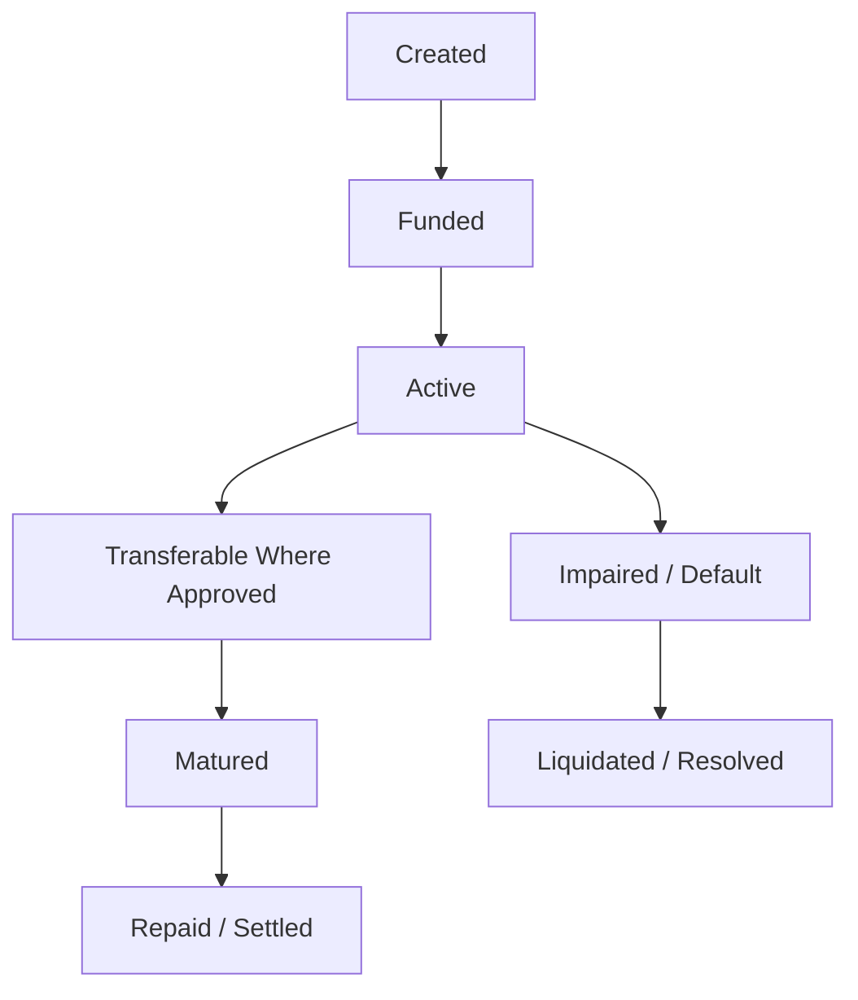

# Tokenized Debt and Secondary Market Architecture

Tokenized debt extends a private credit position into an onchain instrument that can represent ownership, economic terms, and settlement rights under the applicable credit agreement.

The objective is to create a verifiable bridge between structured credit and future market liquidity without weakening the collateral, eligibility, or resolution rules of the underlying position.

## Position representation

An approved credit position can be represented by an onchain token or tokenized record that references the underlying debt terms.

The production design can associate the instrument with information such as:

* Position identifier
* Principal or notional amount
* Maturity
* Applicable economic terms
* Payment status
* Collateral relationship
* Current holder or beneficial position
* Transfer restrictions
* Resolution state

## Lifecycle synchronization

The debt representation must remain synchronized with the underlying credit position.

A position can move through states such as:

Transfers do not erase the underlying borrower obligation, collateral relationship, maturity, or resolution rules.

## Fractionalization

Where legally and technically supported, a debt position can be divided into smaller economic units.

Fractionalization can improve accessibility and secondary-market flexibility, but it also increases the importance of:

* Accurate accounting
* Transfer restrictions
* Holder records
* Payment distribution logic
* Settlement consistency

## Secondary-market transfer

Approved debt instruments can become transferable through supported market infrastructure.

Secondary liquidity can allow a lender to exit before maturity without requiring the borrower to refinance the original obligation.

Transferability depends on:

* Contract permissions
* Position status
* Buyer eligibility
* Applicable legal restrictions
* Available market liquidity
* Pricing and settlement infrastructure

## Pricing

Secondary-market pricing can differ from principal value because a debt instrument can trade based on:

* Remaining time to maturity
* Payment history
* Borrower risk
* Collateral coverage
* Prevailing market rates
* Liquidity
* Expected recovery value
* Market demand


An onchain token does not guarantee continuous liquidity or a specific market price.


## Payment and settlement

The system is designed so that repayment or resolution of the underlying credit position determines the final settlement of the associated debt instrument.

Depending on the production structure, payment flows can include:

* Principal repayment
* Accrued economic return
* Servicing fees
* Marketplace fees
* Liquidation proceeds
* Recovery proceeds after default

## Resolution state

When a position enters default, liquidation, conversion, or another resolution process, the tokenized debt instrument must reflect that state so that market participants are not relying on an outdated representation of the underlying credit.

## Market integrity

Secondary-market infrastructure introduces additional risks beyond the underlying credit position, including:

* Thin liquidity
* Price gaps
* Fragmented venues
* Transfer restrictions
* Settlement risk
* Valuation uncertainty during stress

Onchain Matrix treats secondary liquidity as a separate market layer rather than assuming that tokenization automatically creates liquidity.
