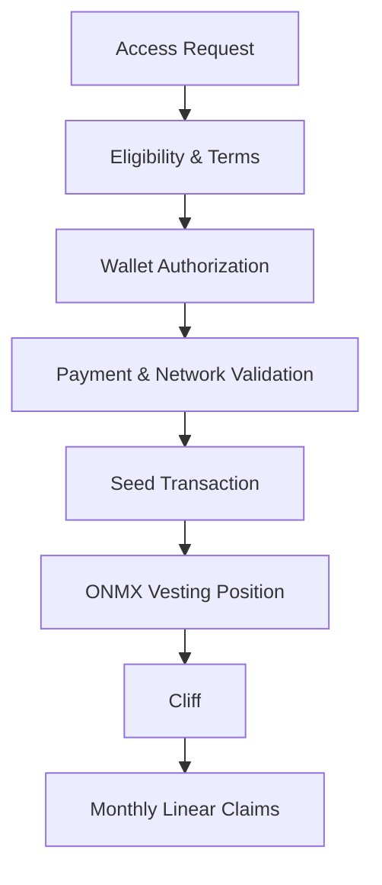

# Seed Access Technical Flow

The Onchain Matrix Seed Round is designed as a permissioned capital-formation process for the initial protocol-owned treasury base.

The public seed interface, applicable Terms, and production contracts govern the final transaction flow.

## Current seed structure

| Term                        | Current structure                                                   |
| --------------------------- | ------------------------------------------------------------------- |
| Round                       | Seed                                                                |
| Allocation                  | 2.5% of total ONMX supply                                           |
| Seed Tokens                 | 25,000,000 ONMX                                                     |
| Seed Price                  | $0.14 per ONMX                                                      |
| Public-Sale / TGE Reference | $0.20 per ONMX                                                      |
| Reference Discount          | 30% to the $0.20 reference price                                    |
| Vesting                     | 6-month cliff + 18-month linear vesting                             |
| Claims                      | Monthly after the cliff under the production vesting implementation |
| Network                     | BNB Chain                                                           |
| Primary Use of Funds        | Treasury formation                                                  |
| Seed Capacity               | $3.5M                                                               |

## Participation architecture

Seed access is permissioned rather than an unrestricted public token-transfer flow.

The access architecture is designed to combine participant eligibility, wallet controls, transaction terms, and onchain settlement before a purchase is accepted.

## Eligibility layer

Participation can be restricted by jurisdiction, participant eligibility, wallet status, applicable Terms, and technical availability.

The live access controls and transaction-specific Terms determine whether a wallet can participate.

## Wallet authorization

Wallet authorization links the participant's approved access state to the address used for the seed transaction and future vesting claims.

Users should verify that the connected wallet, network, and contract addresses match the official Onchain Matrix interface before signing any transaction.

## Payment and settlement

Supported payment assets and networks are defined by the live seed interface and transaction terms.

The settlement flow is designed to validate the payment asset, destination, network, transaction amount, and applicable allocation before the seed transaction is finalized.

## Vesting position

Seed ONMX is not intended to become immediately liquid at TGE.

The 25,000,000 ONMX Seed allocation follows a 6-month cliff followed by 18 months of linear vesting. Monthly claim availability begins after the cliff under the applicable production vesting implementation.

The live vesting contract controls the actual claimable balance and release state.

## Treasury treatment

Capital raised through the Seed Round is intended primarily to form and preserve the productive treasury base.

Treasury capital can then be deployed under the allocation, risk, security, and reporting frameworks described in this documentation.

## Verification

Before participating, verify:

* the official Onchain Matrix domain,
* the connected network,
* the payment asset,
* the seed contract address,
* the vesting contract or provider,
* the applicable Terms,
* the transaction details before signing.

Production contract addresses are listed in **Deployments & Contract Addresses** once active.
