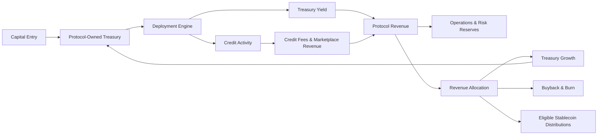

# How It Works

Onchain Matrix is designed as one capital framework with connected capital and revenue flows.

## 1. Capital entry

Capital can enter the ecosystem through approved token-sale activity, liquidity formation, credit participation, and other protocol activity. The objective at the launch stage is to form a durable treasury base rather than consume raised capital as routine operating cash.

## 2. Treasury capital

Protocol-owned treasury capital becomes the primary productive capital base. Treasury policy determines how much remains liquid, how much may be deployed, which asset or strategy categories are approved, and what risk limits apply.

## 3. Deployment engine

Approved capital can be deployed across a diversified mix such as:

- stablecoin and liquidity reserves,
- major crypto assets,
- lower-risk yield strategies,
- tokenized RWAs,
- approved credit participation,
- selectively capped higher-yield opportunities.

## 4. Protocol revenue

Potential protocol revenue can come from multiple sources, including treasury yield, credit spread participation, origination and servicing fees, and pool or marketplace activity.

## 5. Revenue allocation

Protocol revenue is intended to support a combination of:

- operations and infrastructure,
- risk and liquidity reserves,
- treasury growth,
- ONMX buybacks and burns where conditions support them,
- eligible stablecoin distributions where permitted,
- long-term protocol expansion.

The allocation mix can change over time based on treasury policy, risk conditions, legal considerations, market liquidity, and protocol maturity.
