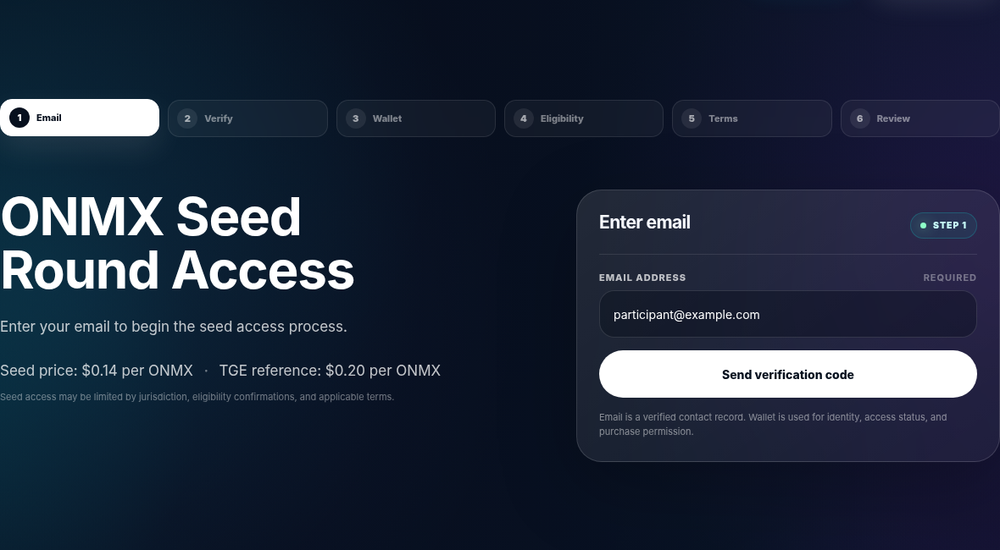
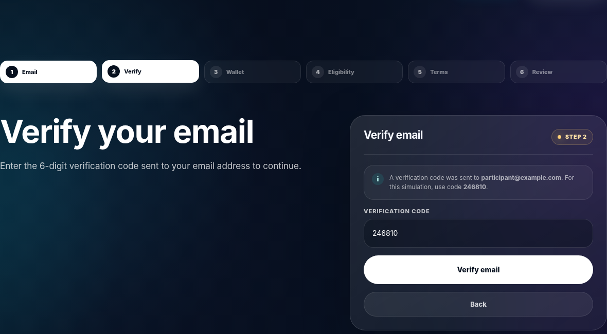
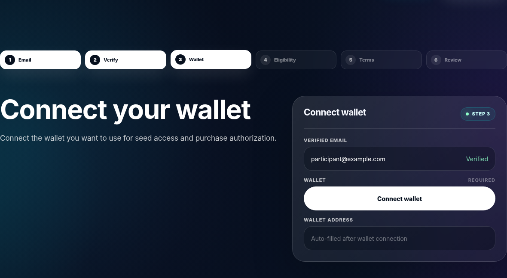
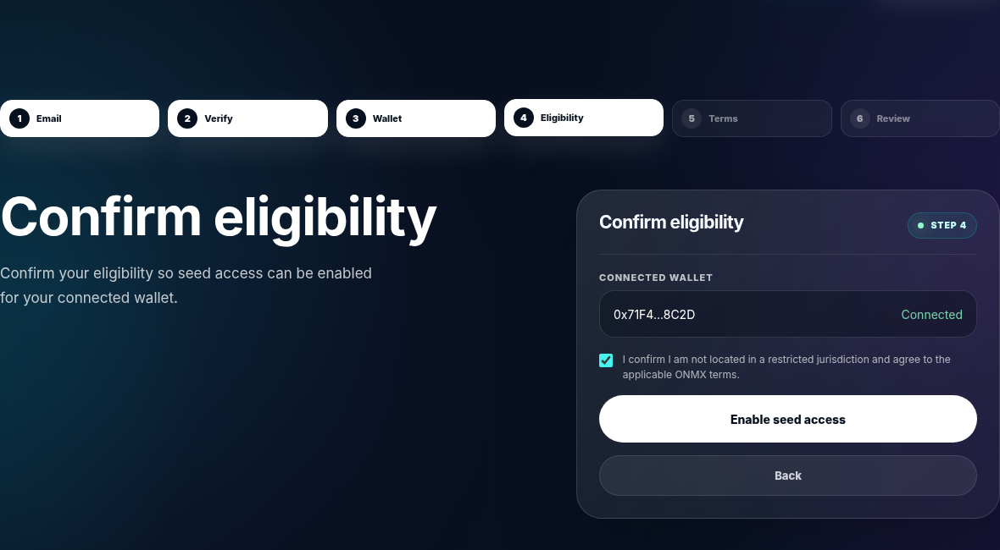
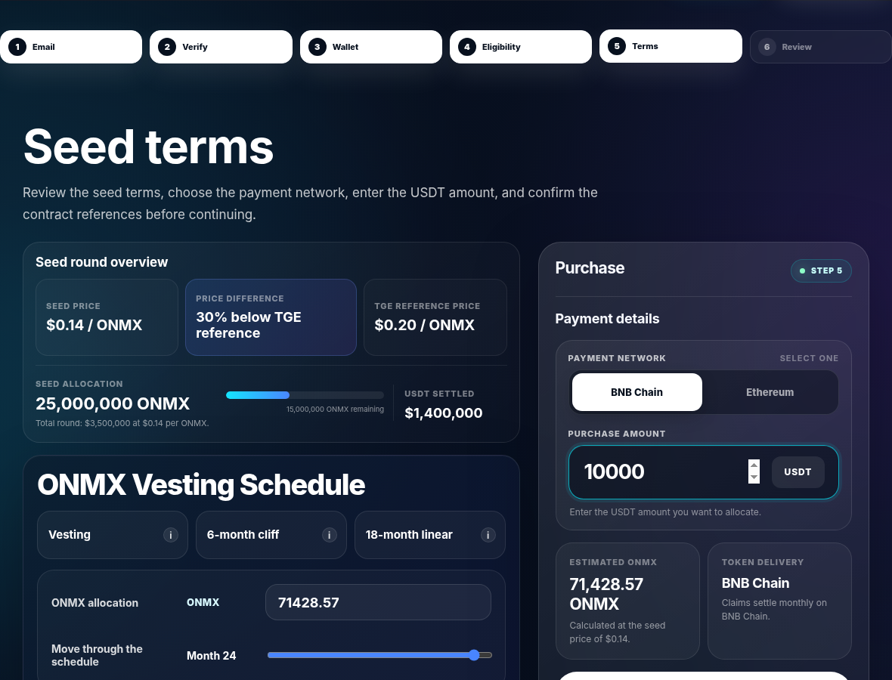
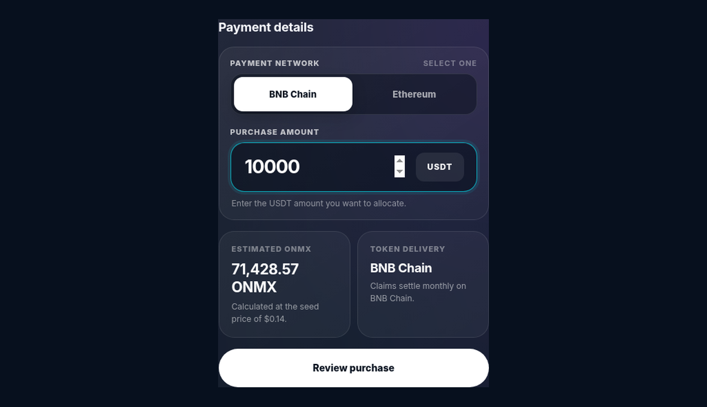
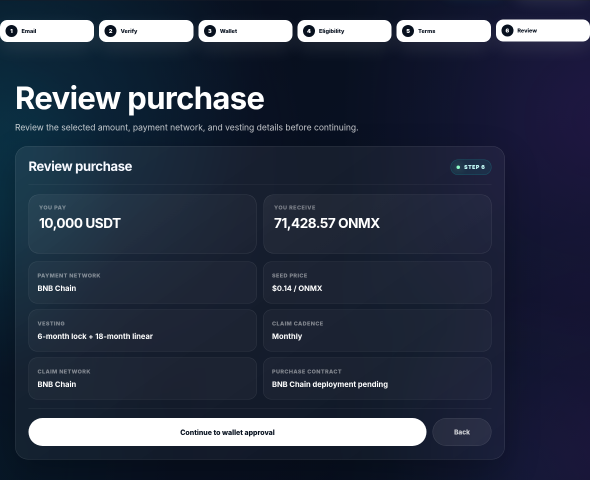
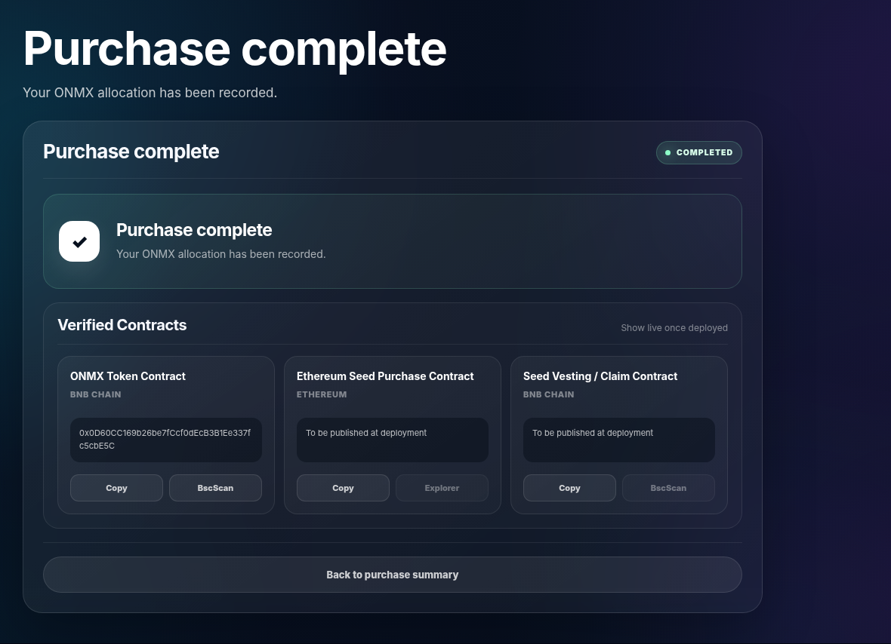
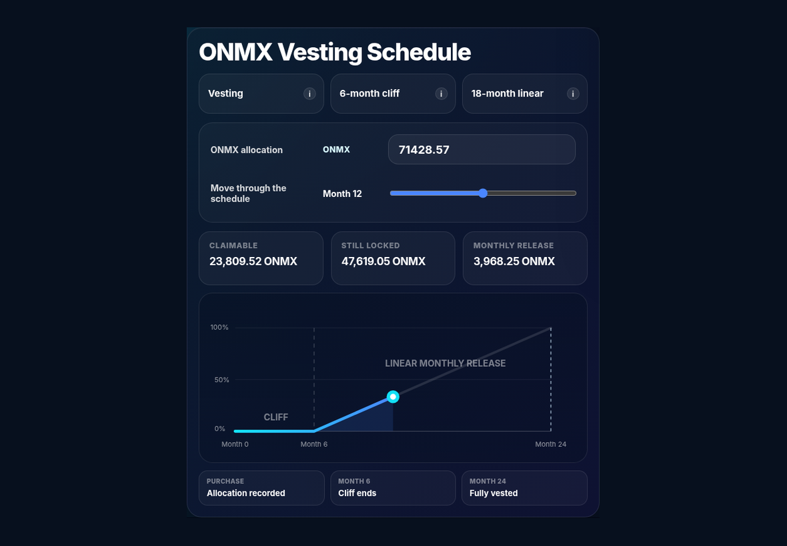

# How to Buy ONMX Visual Guide

## Current Route: Seed Access

Before the Public Sale / TGE stage, ONMX is available through the applicable **permissioned Seed Access process**.

Start only from the official Onchain Matrix website:

**onchainmatrix.com**

The screenshots below reproduce the current Seed Access interface and show the purchase flow from email verification through purchase confirmation. The production interface, applicable Terms, contract addresses, payment networks, and eligibility controls remain authoritative at the time of participation.


**Current Seed structure:** $0.14 per ONMX · $0.20 Public Sale / TGE reference · 6-month cliff + 18-month linear vesting · monthly claims after the cliff under the production implementation.




## Enter your email

Enter your email address to begin the Seed Access process, then select **Send verification code**.

Your email creates the verified contact record used by the access flow. The wallet is connected separately for wallet authorization and the Seed transaction.

<figure><figcaption></figcaption></figure>



## Verify your email

Enter the six-digit verification code sent to your email and select **Verify email**.

The code shown in the screenshot is part of the attached interface simulation. The production website will use the live verification process.

<figure><figcaption></figcaption></figure>



## Connect your wallet

Select **Connect wallet** and connect the wallet you intend to use for Seed Access and purchase authorization.

Before approving any wallet request, confirm the official Onchain Matrix domain, the requested network, and the action displayed by your wallet.&#x20;

<figure><figcaption></figcaption></figure>


**Never provide a private key, seed phrase, or recovery phrase.**




## Confirm eligibility

Review the eligibility confirmation and applicable ONMX terms.

Seed Access is permissioned and may be restricted by jurisdiction, participant eligibility, wallet status, applicable Terms, and technical availability.

Once the confirmation is complete, select **Enable seed access**.

<figure><figcaption></figcaption></figure>



## Review the Seed terms

The Seed Terms screen summarizes the current round economics before a purchase is reviewed.

The current interface shows:

* **Seed price:** $0.14 / ONMX
* **Public Sale / TGE reference:** $0.20 / ONMX
* **Seed allocation:** 25,000,000 ONMX
* **Round capacity:** $3.5 million at $0.14 / ONMX
* **Vesting:** 6-month cliff + 18-month linear vesting
* **Claims:** monthly after the cliff under the production vesting implementation

The Public Sale / TGE reference price is not a guarantee of future market price, listing price, liquidity, or appreciation.

<figure><figcaption></figcaption></figure>



## Select the payment network and enter the amount

Choose one of the payment networks supported by the live interface and enter the amount of **USDT** you want to allocate.

The interface calculates the estimated ONMX allocation using the Seed price before you continue.

Confirm the supported USDT token and network before signing any approval or payment transaction. Different networks can use different USDT contract addresses.

Select **Review purchase** when the details are correct.

<figure><figcaption></figcaption></figure>




## Final purchase review

Before proceeding to wallet approval, review the final transaction summary.

Confirm:

* USDT amount,
* estimated ONMX allocation,
* payment network,
* Seed price,
* vesting structure,
* claim cadence,
* claim network,
* production purchase-contract reference when available.

If any information differs materially from the official Seed interface or current Terms, do not continue until the discrepancy is resolved through an official Onchain Matrix channel.

<figure><figcaption></figcaption></figure>



## Purchase confirmation

After the transaction is successfully completed, the interface records the ONMX allocation and displays the available contract-verification information.

Save your transaction hash and keep a record of the participating wallet, date, settlement amount, and ONMX allocation.

Production Seed and vesting contract addresses should be verified through **Resources → Deployments & Contract Addresses** once they are live.

<figure><figcaption></figcaption></figure>

## Understand your Seed vesting schedule

The Seed interface includes a visual representation of the vesting structure:

**6-month cliff → 18-month linear vesting → monthly claim availability**

During the cliff, Seed ONMX remains restricted. After the cliff, ONMX becomes eligible for release according to the applicable linear schedule.

The screenshot above is a schedule simulation from the current Seed Access interface. The **production vesting contract and Magna allocation state** determine the actual unlocked and claimable balance for each participant.

For the post-purchase vesting experience, continue to:

**Seed Access → Magna Dashboard — Vesting & Claims**

<figure><figcaption></figcaption></figure>

## Security checklist

Before every ONMX Seed transaction:

* Start from **onchainmatrix.com**.
* Review the current Terms.
* Confirm the connected network.
* Confirm the official contract or destination.
* Confirm the correct USDT token.
* Review every wallet approval before signing.
* Never share a seed phrase or private key.
* Ignore unsolicited payment or claim instructions.
* Save your transaction hash after completion.

## Important Notice


Seed participation involves digital-asset, smart-contract, market, liquidity, regulatory, operational, and cybersecurity risk.

The $0.20 Public Sale / TGE reference price does not guarantee future market price or liquidity. Vesting does not guarantee future token value or market availability.

Participants are responsible for confirming eligibility and compliance with the applicable Terms and law.

