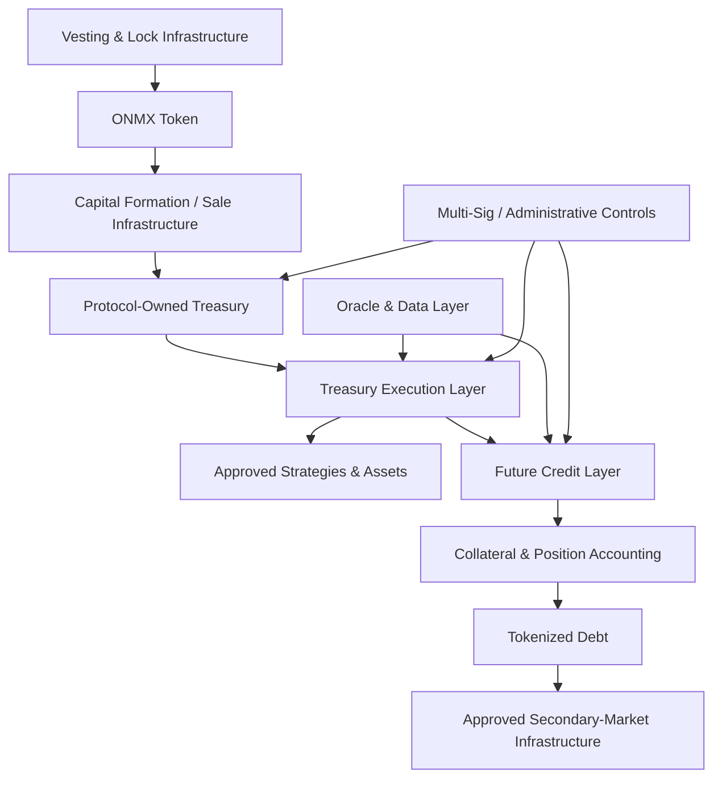

# Smart Contract Architecture

Onchain Matrix is designed as a modular onchain capital system rather than a single monolithic contract. Treasury custody, token supply, capital deployment, vesting, future credit markets, market data, and administrative controls are separated so that each component can have a clearly defined responsibility and permission boundary.

## Architecture overview

The exact production contracts associated with each layer are listed in **Deployments & Contract Addresses** as they become active.

## ONMX token layer

ONMX is deployed on BNB Chain as a BEP-20 ecosystem token with a fixed total supply of 1,000,000,000 ONMX.

The token layer provides the base supply and transfer functionality used by the broader protocol. Token economics are designed around fixed supply, treasury formation, protocol utility, and non-inflationary value capture rather than ongoing minting for rewards.

## Capital-formation layer

Sale and participation infrastructure is designed to control how approved ONMX allocations are released into the ecosystem during seed, presale, public-sale, or other authorized capital-formation activity.

Capital-formation contracts and interfaces can enforce transaction-specific conditions such as:

* allocation limits,
* payment requirements,
* wallet eligibility,
* network requirements,
* vesting or claim rules,
* applicable participation terms.

Production sale contracts are independently listed in the deployment registry.

## Treasury custody layer

Protocol-owned treasury capital is controlled through a Gnosis Safe multi-signature structure rather than a single private key.

The treasury custody layer is responsible for high-impact asset authority. It is intentionally separated from routine automation so that execution systems do not automatically receive unrestricted custody powers.

## Treasury execution layer

The treasury execution layer is designed to route approved capital into permitted assets and strategies under treasury policy.

Execution can be constrained by:

* allocation limits,
* reserve requirements,
* supported asset lists,
* strategy allowlists,
* liquidity requirements,
* risk tiers,
* market conditions,
* emergency restrictions.

As treasury automation matures, routine actions can become more programmatic while policy and high-impact authority remain separately controlled.

## Vesting and lock layer

Vesting and lock infrastructure separates restricted or long-duration ONMX supply from normal public circulation. Onchain Matrix has selected Magna, powered by Kraken, as token lifecycle infrastructure for material ONMX vesting and lock structures.&#x20;

The 72.5% Treasury Reserve & LP allocation is intended to use an eight-year structure; the 5% Team & Advisors allocation is intended to vest over four years; and the 2.5% Seed allocation follows a six-month cliff followed by eighteen months of linear vesting.&#x20;

Production Magna contracts and current onchain state are authoritative for live restricted balances, vesting status, and claim mechanics.

## Credit layer

The future credit layer is designed as a separate set of contracts and modules supporting:

* P2P structured credit,
* pool-based liquidity,
* treasury participation,
* collateral lock,
* position accounting,
* LTV monitoring,
* repayment,
* liquidation,
* default resolution,
* tokenized debt representation.

Credit-market contracts are roadmap infrastructure until publicly deployed and verified.

## Oracle and data layer

Oracle and data infrastructure supplies or validates the external information used for valuation, collateral health, risk limits, and reporting.

Data authority is separated from asset custody. A data provider does not receive treasury transfer authority simply because its data is used by protocol logic.

## Administrative and emergency controls

Privileged functions are designed around explicit roles and permission boundaries.

Depending on the production component, controls can include:

* multi-signature approval,
* role-based administration,
* timelocked execution,
* pause or restriction modules,
* controlled upgrade authority,
* post-deployment monitoring.

## Proxy and implementation transparency

For upgradeable production components, public documentation distinguishes the proxy address from the active implementation and identifies the applicable control path.

This makes it possible to evaluate not only the code currently serving users but also the authority capable of changing that code.

## Modularity principle

The architecture is designed so that changes to one subsystem do not automatically require unrestricted access to every other subsystem. Treasury custody, risk administration, oracle data, credit operations, and token supply are treated as separate control domains.
