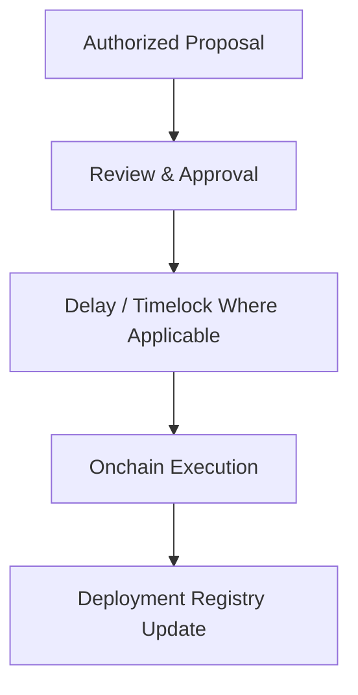

# Protocol Roles and Permissions

Onchain Matrix separates authority across treasury custody, routine execution, risk controls, upgrades, data infrastructure, and emergency response. The objective is to reduce single-point failure and limit the impact of any one compromised role.

No operational role is intended to have unrestricted authority across the entire protocol.

## Control model

The protocol separates six core control functions:

1. Treasury custody
2. Treasury operations and automation
3. Risk administration
4. Contract administration and upgrades
5. Emergency controls
6. Oracle and data infrastructure

Future credit-market contracts introduce additional roles for origination, servicing, monitoring, pools, and resolution.

## Role framework

| Role                               | Primary responsibility                                  | Permitted scope                                                                                | Structural limitation                                                          |
| ---------------------------------- | ------------------------------------------------------- | ---------------------------------------------------------------------------------------------- | ------------------------------------------------------------------------------ |
| Treasury Multi-Sig                 | Critical treasury custody and high-impact approvals     | Treasury transactions and authorized administrative actions                                    | No single signer can unilaterally exercise multi-signature authority           |
| Treasury Operations / Automation   | Execute approved treasury policy                        | Deploy or rebalance capital inside approved strategies, limits, and controls                   | Cannot independently remove treasury-wide limits or rewrite policy             |
| Risk Administration                | Maintain approved risk parameters                       | Adjust supported caps, collateral parameters, limits, or restrictions within authorized ranges | Does not receive unrestricted treasury withdrawal authority                    |
| Upgrade / Administrative Authority | Manage controlled contract changes                      | Execute authorized upgrades and configuration changes                                          | High-impact changes follow the applicable approval path and delay process      |
| Emergency Control                  | Reduce damage during abnormal conditions                | Pause or restrict supported activity where implemented                                         | Narrowly scoped and subject to controlled custody and access rules             |
| Oracle / Data Infrastructure       | Supply or validate external data used by protocol logic | Market prices, valuation inputs, risk data, and reporting inputs                               | Separate from treasury custody and subject to validation and fallback controls |
| Credit-Market Roles                | Operate future collateralized-credit infrastructure     | Origination, servicing, monitoring, pool administration, and resolution as implemented         | Authority is limited by the specific credit contract and published parameters  |

## Treasury custody

Critical treasury authority is designed around multi-party authorization rather than a single wallet or private key.

The treasury custody structure is designed to provide:

* Multiple approvals for sensitive actions
* Auditable onchain transaction history
* Separation between routine execution and high-impact policy changes
* Restricted administrative access
* Controlled signer changes
* Operational procedures that protect recovery material and sensitive access information

Public transparency focuses on the controlling address, approval structure, and executed actions rather than the personal identities of individual signers.

## Routine execution vs. policy authority

Treasury operations and treasury policy are separate functions.

Operational wallets or automation can execute approved actions inside predefined constraints. These constraints can include approved strategies, allocation ranges, liquidity requirements, exposure limits, and market-response conditions.

Routine execution is not intended to provide authority to:

* Remove treasury-wide controls
* Add arbitrary high-risk strategies
* Transfer unrestricted treasury capital
* Change critical ownership
* Bypass upgrade or emergency controls

Automation exists to enforce disciplined execution, not to create unlimited autonomous authority.

## Risk administration

Risk administration governs the conditions under which capital can be exposed.

The control surface can include:

* Collateral eligibility
* LTV thresholds
* Warning and liquidation zones
* Debt ceilings
* Borrower or pool caps
* Strategy exposure limits
* Liquidity requirements
* Oracle safeguards
* Market-response thresholds

Risk roles are designed to constrain or reduce exposure without automatically gaining unrelated treasury-custody powers.

## Upgrade authority

Upgradeable infrastructure can provide flexibility during early protocol deployment, but upgrade authority is itself a material control risk.

High-impact changes are designed around a controlled sequence:

As the protocol matures, upgrade authority can be reduced, constrained, or disabled where technically appropriate.

## Emergency authority

Emergency controls exist to reduce potential damage during abnormal conditions. Depending on the relevant contract, supported actions can include:

* Pausing new activity
* Restricting selected operations
* Reducing exposure
* Disabling an affected integration
* Blocking a compromised execution path

Emergency authority is intended to remain narrow, observable, and separate from unrestricted treasury transfers.

## Public accountability or third-party infrastructure

For privileged onchain roles, Onchain Matrix is designed to expose enough information for independent review of:

* Controlling addresses
* Granted permissions
* The contracts to which permissions apply
* Material changes to those permissions
* Executed privileged actions

Sensitive credentials, signer identities, recovery material, and internal infrastructure details remain protected.

**Token lifecycle infrastructure is separately administered through the applicable Magna production contracts and workflows. Magna's role does not replace the protocol's treasury multi-signature controls or grant unrestricted treasury authority.**
