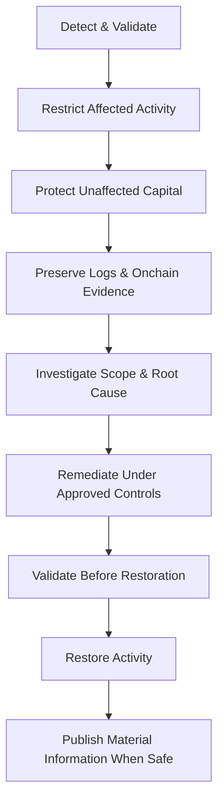

# Security Center

Security is part of the core Onchain Matrix architecture across custody, smart contracts, infrastructure, access control, upgrades, monitoring, and incident response.

No security framework can eliminate all risk. The objective is to reduce attack surface, limit authority, make critical activity observable, and improve the protocol's ability to detect and respond to abnormal conditions.

## Security model

Onchain Matrix is designed around six layers of control:



## Multi-party treasury custody

Critical treasury authority requires multiple approvals rather than unilateral control.



## Privileged access security

Administrative access is permissioned, segmented, and minimized.



## Smart-contract security

Production contracts follow structured development, testing, verification, review, and deployment procedures.



## Controlled upgrades

High-impact changes follow defined approval paths and delay mechanisms where implemented.



## Continuous monitoring

Treasury movements, privileged actions, contract state, infrastructure events, and oracle conditions can be monitored for abnormal behavior.



## Emergency response

Protective controls can restrict affected activity where technically appropriate during a security event.



## Security status

| Area                             | Current status                                                                   |
| -------------------------------- | -------------------------------------------------------------------------------- |
| Multi-signature treasury control | Part of the active protocol security architecture                                |
| Public contract verification     | Required for production deployments where supported                              |
| Controlled upgrade procedures    | Part of the protocol design                                                      |
| Monitoring and incident response | Part of the operational security model                                           |
| External audit reports           | Listed after completion and public release                                       |
| Public bug bounty                | Listed only when an active program is formally launched                          |
| Incident history                 | Material incidents and post-incident information are published where appropriate |

## Smart-contract security lifecycle

Material production contracts are designed to move through a disciplined lifecycle that can include:

* specification and architecture review,
* threat modeling,
* unit and integration testing,
* role and permission review,
* failure-mode and edge-case testing,
* static or automated analysis where appropriate,
* internal review,
* external review or audit for material contracts,
* source-code verification after deployment,
* post-deployment monitoring.


Security reviews reduce risk but do not guarantee that a contract is free of vulnerabilities.


## Third-party token lifecycle infrastructure

ONMX uses third-party token lifecycle infrastructure through Magna, powered by Kraken, for material vesting, lock, and claim workflows. The integration reduces reliance on manual internal token administration and provides additional operational separation and verification, but it also introduces third-party and smart-contract dependencies that remain part of the protocol's risk model.

## Audits and independent review

Only completed, publicly accessible security reviews are represented as completed audits.

Audit reports and independent reviews are linked from official Onchain Matrix channels after publication. The live production deployment and its corresponding report should always be matched by contract address and version where applicable.

## Responsible disclosure

Security researchers who identify a potential vulnerability can report it through the official contact route published by Onchain Matrix.

A useful vulnerability report includes:

* affected contract, interface, or system,
* network and address where applicable,
* technical description,
* reproduction steps or proof of concept,
* potential impact,
* recommended mitigation if known,
* a secure method of contact.


Researchers are encouraged to avoid public disclosure of an exploitable issue before the protocol has had a reasonable opportunity to investigate and mitigate the risk.


## Monitoring

Security monitoring can cover:

* treasury movements,
* multisig and privileged transactions,
* contract ownership or implementation changes,
* abnormal contract events,
* unexpected protocol-state changes,
* oracle anomalies,
* infrastructure authentication events,
* service availability,
* suspicious interaction patterns.

Monitoring focuses on actionable signals without exposing sensitive internal infrastructure or response procedures.

## Incident response

A material security event can trigger a controlled response sequence:


Emergency powers are themselves sensitive and remain subject to controlled custody and access principles.


## Public security evidence

Security claims are designed to be supported by evidence wherever practical, including:

* verified production contracts,
* multisig transaction history,
* role and permission data,
* timelock activity,
* published audit or review reports,
* onchain events,
* deployment records,
* incident reports where applicable.

## User security checklist

Before interacting with Onchain Matrix:

* use the official website and GitBook,
* verify the network before signing,
* confirm the contract address against the official deployment registry,
* verify the address on BscScan,
* do not trust unsolicited direct messages,
* never share seed phrases or private keys,
* review permissions before signing a transaction,
* confirm that a roadmap feature has a published production deployment before using it.
