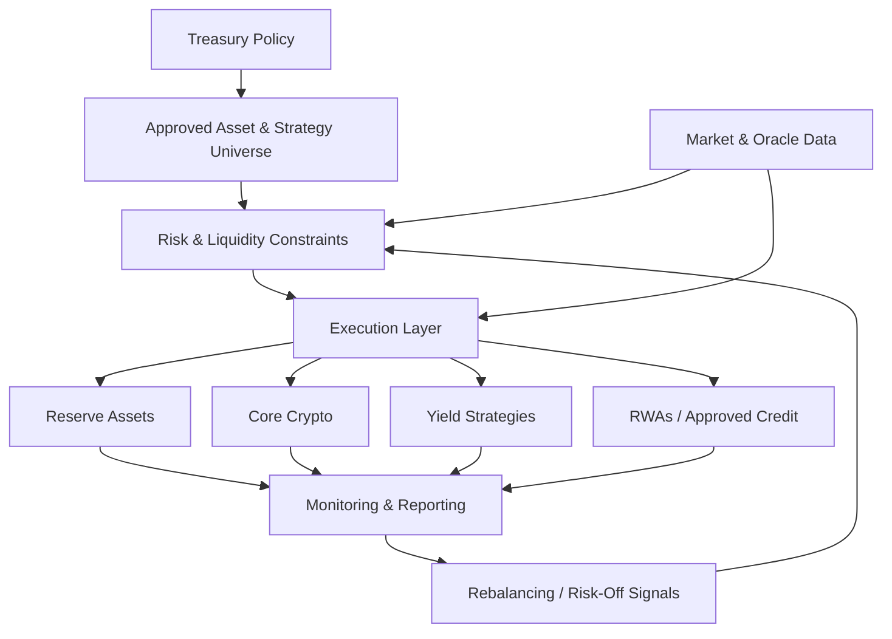

# Treasury Execution and Automation Architecture

The Onchain Matrix Treasury & Yield Engine is designed to convert treasury policy into controlled capital deployment while preserving a separation between custody, strategy execution, risk limits, monitoring, and reporting.

Automation is used to enforce discipline. It is not intended to remove policy oversight or create unrestricted autonomous control over treasury capital.

## Execution model

## Treasury policy layer

Treasury policy defines the boundaries within which capital can be managed.

Policy can specify:

* Approved asset categories
* Approved strategies
* Reserve requirements
* Allocation ranges
* Concentration limits
* Liquidity requirements
* Strategy and protocol caps
* Risk tiers
* Rebalancing conditions
* Emergency restrictions

Policy authority is separate from routine execution authority.

## Approved strategy universe

Capital is deployed only through approved assets and strategies that satisfy the applicable risk framework.

Evaluation can include:

* Smart-contract risk
* Protocol maturity
* Liquidity depth
* Withdrawal mechanics
* Oracle design
* Counterparty exposure
* Custody model
* Market structure
* Historical reliability
* Yield sustainability

An attractive headline yield is not sufficient for approval.

## Reserve and liquidity management

A portion of treasury capital can remain in liquid or lower-volatility reserve assets to preserve maneuverability.

Reserve capital supports:

* Operating resilience
* Market-response flexibility
* Credit funding capacity
* Collateral or liquidity needs
* Risk-off positioning
* Timely exits from other strategies

Treasury deployment is therefore evaluated against both expected return and the liquidity required to manage the overall system safely.

## Event- and threshold-based rebalancing

The treasury is designed around event- and threshold-based management rather than a permanently static allocation.

Rebalancing can respond to:

* Allocation drift
* Reserve requirements
* Liquidity changes
* Material yield changes
* Strategy risk changes
* Volatility
* Collateral conditions
* Oracle anomalies
* Protocol or counterparty events
* Breach of approved limits

This allows the system to respond to changing market conditions without committing to a rigid public schedule of future transactions.

## Risk-off controls

When predefined risk conditions are met, the execution framework can reduce or restrict exposure.

Potential actions include:

* Stopping new deployment
* Reducing a strategy allocation
* Increasing liquid reserves
* Disabling an affected integration
* Restricting new credit exposure
* Requiring controlled manual review

## Volatility allocation playbook

Market dislocation can create opportunity, but deployment remains subordinate to liquidity and risk controls.



## Preserve liquidity and reduce unnecessary risk



## Selectively accumulate approved assets

Selectively accumulate approved assets when market depth supports execution.



## Execute ONMX buybacks

Execute ONMX buybacks only when permitted by policy and supported by treasury, market, legal, and liquidity conditions.



## Burn repurchased ONMX

Burn repurchased ONMX where the applicable token-economics policy calls for supply reduction.



## Reposition for recovery

Reposition for recovery while maintaining exposure constraints.



## Execution discretion and market integrity

Onchain Matrix does not publish a mechanical schedule of future treasury trades, reserve releases, or buybacks.

The protocol can provide supply and treasury transparency without pre-announcing execution details that could create a front-running, shorting, or security target.

## Monitoring and reporting

The execution layer is designed to produce an observable record of capital movement and strategy activity.

Monitoring can cover:

* Treasury balances
* Strategy exposure
* Reserve levels
* Contract events
* Realized yield
* Oracle conditions
* Protocol health
* Administrative actions

Public reporting aggregates this information at a level that supports accountability without disclosing sensitive execution instructions before they occur.
